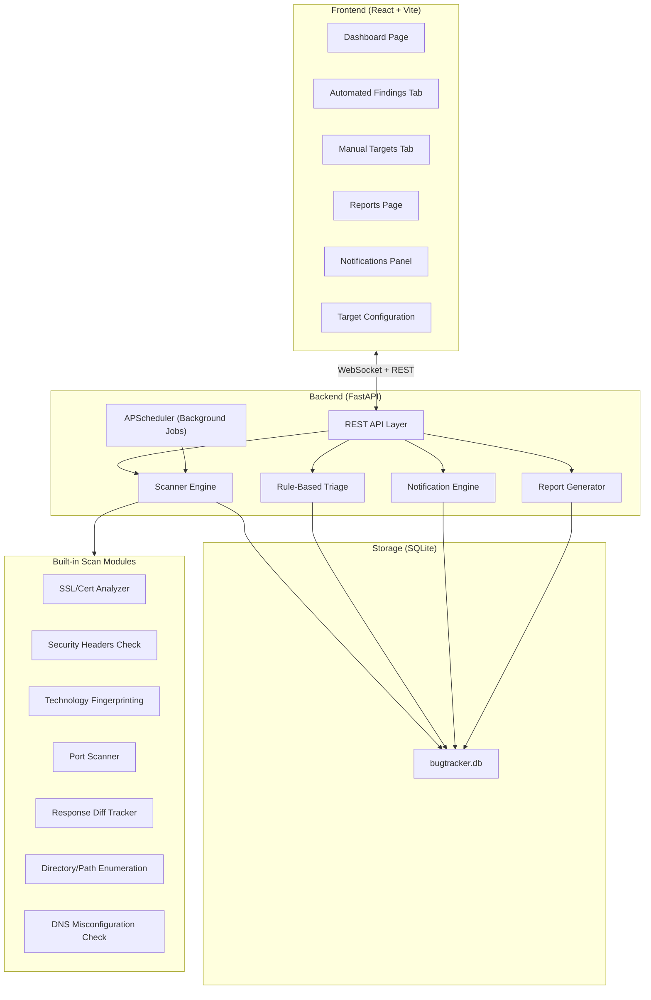

# Automated Bug Bounty Tracker — Implementation Plan

A real-time, enterprise-grade bug bounty tracking application with automated security scanning, a responsive dashboard, notifications, and report generation.

---

## Architecture Overview



---

## Tech Stack

| Layer | Technology | Reason |
|-------|-----------|--------|
| **Backend** | Python 3.11+ / FastAPI | Async-native, fast, great for background tasks |
| **Database** | SQLite + SQLAlchemy | Zero-setup, file-based, works locally, easy to migrate to PostgreSQL later |
| **Task Scheduler** | APScheduler | In-process background job scheduling for periodic scans |
| **Real-time** | WebSockets (FastAPI) | Push scan results and notifications to dashboard instantly |
| **Frontend** | React 18 + Vite | Fast dev experience, component-based, responsive |
| **Styling** | CSS (custom design system) | Premium dark theme, glassmorphism, no Tailwind |
| **Auth** | JWT (simple admin login) | Single-user password-based auth |
| **Charts** | Recharts | Lightweight, React-native charting |

---

## Project Structure

```
d:\Automated-Tool\
├── backend/
│   ├── app/
│   │   ├── __init__.py
│   │   ├── main.py                 # FastAPI app, startup events, CORS
│   │   ├── config.py               # App settings (SECRET_KEY, DB path, etc.)
│   │   ├── database.py             # SQLAlchemy engine + session
│   │   ├── auth.py                 # JWT auth (login, token verification)
│   │   ├── models.py               # All SQLAlchemy models
│   │   ├── schemas.py              # Pydantic request/response schemas
│   │   ├── websocket_manager.py    # WebSocket connection manager
│   │   ├── scheduler.py            # APScheduler setup + job definitions
│   │   ├── notifications.py        # Notification creation + broadcasting
│   │   ├── report_generator.py     # Generate vulnerability reports
│   │   ├── scanner/
│   │   │   ├── __init__.py
│   │   │   ├── orchestrator.py     # Runs all scan modules against a target
│   │   │   ├── ssl_analyzer.py     # SSL/TLS cert checks
│   │   │   ├── header_checker.py   # Security headers (CSP, HSTS, X-Frame, etc.)
│   │   │   ├── tech_fingerprint.py # Identify server tech, CMS, frameworks
│   │   │   ├── port_scanner.py     # Basic TCP port scanning
│   │   │   ├── dir_enumerator.py   # Common path/directory brute-check
│   │   │   ├── dns_checker.py      # DNS misconfig (zone transfer, DNSSEC, etc.)
│   │   │   └── diff_tracker.py     # Detect response changes over time
│   │   ├── triage/
│   │   │   ├── __init__.py
│   │   │   └── rule_engine.py      # CVSS-like scoring + severity assignment
│   │   └── routers/
│   │       ├── __init__.py
│   │       ├── auth_router.py      # POST /login
│   │       ├── targets.py          # CRUD for target websites
│   │       ├── scans.py            # Scan history + trigger manual scans
│   │       ├── findings.py         # Vulnerability findings list + detail
│   │       ├── reports.py          # Generate + download reports
│   │       ├── notifications.py    # Read + dismiss notifications
│   │       └── dashboard.py        # Aggregated stats for dashboard
│   ├── requirements.txt
│   └── run.py                      # Uvicorn launch script
├── frontend/
│   ├── (React + Vite project — initialized with create-vite)
│   ├── src/
│   │   ├── main.jsx
│   │   ├── App.jsx
│   │   ├── index.css               # Global design system (dark theme, glassmorphism)
│   │   ├── api/
│   │   │   ├── client.js           # Axios instance with JWT interceptor
│   │   │   └── websocket.js        # WebSocket connection handler
│   │   ├── context/
│   │   │   ├── AuthContext.jsx      # Auth state management
│   │   │   └── NotificationContext.jsx
│   │   ├── pages/
│   │   │   ├── Login.jsx
│   │   │   ├── Dashboard.jsx        # Overview: stats cards, charts, recent findings
│   │   │   ├── AutomatedFindings.jsx # Automated scan results tab
│   │   │   ├── ManualTargets.jsx     # Manual testing targets for weekends
│   │   │   ├── TargetConfig.jsx      # Add/edit/remove target websites
│   │   │   ├── ScanHistory.jsx       # All past scans with status
│   │   │   ├── Reports.jsx           # Generated reports list + download
│   │   │   └── FindingDetail.jsx     # Deep-dive into a single finding
│   │   ├── components/
│   │   │   ├── Sidebar.jsx
│   │   │   ├── TopBar.jsx
│   │   │   ├── StatsCard.jsx
│   │   │   ├── FindingsTable.jsx
│   │   │   ├── SeverityBadge.jsx
│   │   │   ├── NotificationPanel.jsx
│   │   │   ├── ScanProgressBar.jsx
│   │   │   └── Chart.jsx
│   │   └── styles/
│   │       ├── dashboard.css
│   │       ├── sidebar.css
│   │       ├── tables.css
│   │       ├── cards.css
│   │       ├── forms.css
│   │       └── notifications.css
│   └── package.json
└── config/
    └── targets.json                 # Default target configuration file
```

---

## Proposed Changes (Build Order)

### Phase 1 — Backend Foundation

#### [NEW] backend/requirements.txt
Python dependencies: `fastapi`, `uvicorn[standard]`, `sqlalchemy`, `aiosqlite`, `apscheduler`, `httpx`, `python-jose[cryptography]`, `passlib[bcrypt]`, `pydantic`, `python-multipart`, `websockets`

#### [NEW] backend/app/config.py
Application settings — DB path, secret key, default admin credentials, scan intervals, CORS origins.

#### [NEW] backend/app/database.py
Async SQLAlchemy engine pointing to `bugtracker.db`. Session factory and `get_db` dependency.

#### [NEW] backend/app/models.py
SQLAlchemy ORM models:
- **Target** — `id`, `url`, `name`, `scope_details`, `platform` (HackerOne/Bugcrowd/custom), `scan_mode` (auto/manual), `scan_interval_minutes`, `is_active`, `created_at`, `updated_at`
- **Scan** — `id`, `target_id` (FK), `status` (pending/running/completed/failed), `started_at`, `completed_at`, `findings_count`, `scan_type`
- **Finding** — `id`, `scan_id` (FK), `target_id` (FK), `title`, `description`, `severity` (critical/high/medium/low/info), `category`, `evidence`, `cvss_score`, `is_false_positive`, `status` (new/reviewed/reported/resolved), `first_seen`, `last_seen`
- **Notification** — `id`, `title`, `message`, `type` (finding/scan/report/alert), `is_read`, `related_id`, `created_at`
- **Report** — `id`, `target_id`, `title`, `content_json`, `findings_count`, `generated_at`
- **DiffSnapshot** — `id`, `target_id`, `url_path`, `response_hash`, `response_snippet`, `captured_at`

#### [NEW] backend/app/schemas.py
Pydantic models for all API request/response bodies.

#### [NEW] backend/app/auth.py
- Password hashing with bcrypt
- JWT token creation/verification
- `get_current_user` dependency for protected routes

---

### Phase 2 — Scanner Engine

#### [NEW] backend/app/scanner/ssl_analyzer.py
- Check certificate validity, expiry, issuer chain
- Detect weak cipher suites, protocol downgrades (SSLv3, TLS 1.0)
- Flag self-signed certs, wildcard misuse, SAN mismatches

#### [NEW] backend/app/scanner/header_checker.py
Check for presence and correct configuration of:
- `Strict-Transport-Security` (HSTS)
- `Content-Security-Policy` (CSP)
- `X-Frame-Options`
- `X-Content-Type-Options`
- `X-XSS-Protection`
- `Referrer-Policy`
- `Permissions-Policy`
- Server version exposure (`Server`, `X-Powered-By`)

#### [NEW] backend/app/scanner/tech_fingerprint.py
- Parse response headers and HTML for framework/CMS signatures
- Identify outdated software versions with known CVEs
- Detect JavaScript library versions via script tags

#### [NEW] backend/app/scanner/port_scanner.py
- Async TCP connect scan on common ports (80, 443, 8080, 8443, 3000, 5000, etc.)
- Detect unexpected open services

#### [NEW] backend/app/scanner/dir_enumerator.py
- Check for common exposed paths: `/admin`, `/.env`, `/.git/config`, `/wp-admin`, `/phpmyadmin`, `/api/docs`, `/swagger.json`, `/.well-known/security.txt`, `/robots.txt`, `/sitemap.xml`, `/backup`, `/debug`
- Flag accessible admin panels and config files

#### [NEW] backend/app/scanner/dns_checker.py
- Check DNSSEC configuration
- Attempt zone transfer detection
- Check SPF/DKIM/DMARC records (email security posture)

#### [NEW] backend/app/scanner/diff_tracker.py
- Hash response bodies and store snapshots
- Compare against previous snapshots to detect changes
- Alert on new endpoints, removed security headers, content changes

#### [NEW] backend/app/scanner/orchestrator.py
- Takes a `Target`, runs all scan modules in parallel using `asyncio.gather`
- Collects results, deduplicates findings against existing DB entries
- Saves new findings, updates `last_seen` on existing ones
- Triggers triage scoring and notification creation

---

### Phase 3 — Triage, Reports & Notifications

#### [NEW] backend/app/triage/rule_engine.py
Rule-based severity scoring:
- CVSS-like formula based on: exploitability, impact, exposure
- Auto-categorize findings (cert issue, missing header, exposed path, info disclosure, etc.)
- Flag duplicates across scans
- Mark confidence level (high/medium/low)

#### [NEW] backend/app/report_generator.py
- Generate structured JSON/Markdown reports per target or per finding
- Include: title, severity, evidence, reproduction steps (templated), remediation advice
- Format suitable for bug bounty platform submission

#### [NEW] backend/app/notifications.py
- Create in-app notifications for: new critical/high findings, scan completions, report generation
- Broadcast via WebSocket for real-time dashboard updates

#### [NEW] backend/app/websocket_manager.py
- Manage active WebSocket connections
- Broadcast events: `new_finding`, `scan_started`, `scan_completed`, `notification`

#### [NEW] backend/app/scheduler.py
- APScheduler integration — register periodic scan jobs per target based on `scan_interval_minutes`
- Job lifecycle management (add/remove/pause targets)

---

### Phase 4 — API Routes

#### [NEW] backend/app/routers/auth_router.py
- `POST /api/auth/login` — returns JWT token

#### [NEW] backend/app/routers/targets.py
- `GET /api/targets` — list all targets (filterable by scan_mode)
- `POST /api/targets` — add a new target
- `PUT /api/targets/{id}` — edit target
- `DELETE /api/targets/{id}` — remove target
- `POST /api/targets/{id}/scan` — trigger an immediate scan

#### [NEW] backend/app/routers/findings.py
- `GET /api/findings` — paginated list (filterable by severity, category, target, status)
- `GET /api/findings/{id}` — single finding with full evidence
- `PATCH /api/findings/{id}` — update status (reviewed, false positive, reported)

#### [NEW] backend/app/routers/scans.py
- `GET /api/scans` — scan history
- `GET /api/scans/{id}` — scan detail with findings

#### [NEW] backend/app/routers/reports.py
- `POST /api/reports/generate/{target_id}` — generate report
- `GET /api/reports` — list generated reports
- `GET /api/reports/{id}` — get report content

#### [NEW] backend/app/routers/notifications.py
- `GET /api/notifications` — list (unread first)
- `PATCH /api/notifications/{id}/read` — mark as read
- `POST /api/notifications/read-all` — mark all as read

#### [NEW] backend/app/routers/dashboard.py
- `GET /api/dashboard/stats` — total targets, findings by severity, active scans, recent activity
- `GET /api/dashboard/trends` — findings over time (chart data)

#### [NEW] backend/app/main.py
FastAPI application assembly — mount all routers, configure CORS, start scheduler on startup, serve WebSocket endpoint.

#### [NEW] backend/run.py
Uvicorn launch script: `uvicorn app.main:app --reload --host 0.0.0.0 --port 8000`

---

### Phase 5 — Frontend Dashboard

#### [NEW] frontend/ (Vite + React project)
Initialize with `npx create-vite`

#### [NEW] frontend/src/index.css
Premium dark theme design system:
- Color palette: deep navy backgrounds (#0a0f1e, #111827), electric accent blues (#3b82f6, #60a5fa), warning amber (#f59e0b), critical red (#ef4444), success green (#10b981)
- Glassmorphism cards with `backdrop-filter: blur` and subtle borders
- Smooth transitions and micro-animations
- Responsive grid system (sidebar collapses on mobile)
- Typography: Inter font family from Google Fonts

#### [NEW] Core layout components
- **Sidebar.jsx** — Navigation with icons, collapsible on mobile, active state indicators
- **TopBar.jsx** — Search bar, notification bell with unread count badge, user menu

#### [NEW] Dashboard page
- **Stats cards row** — Total targets, active scans, findings (by severity breakdown), scan success rate
- **Findings trend chart** — Line chart showing findings over time
- **Recent critical findings** — Live-updating table
- **Scan activity timeline** — Recent scan runs with status

#### [NEW] Automated Findings page
- Filterable, sortable table of all automated scan findings
- Severity badges with color coding
- Quick actions: mark reviewed, mark false positive, generate report
- Click-through to finding detail

#### [NEW] Manual Targets page
- Card grid layout showing targets configured for manual testing
- Each card shows: target name, URL, platform, scope details, last checked date
- "Start Testing" button to open target URL
- Priority indicators

#### [NEW] Target Configuration page
- Form to add new targets (URL, name, scan mode, interval, platform, scope)
- Editable list of existing targets with toggle for active/inactive
- Separate sections for auto vs manual targets

#### [NEW] Reports page
- List of generated reports with download options
- Report preview modal
- Generate new report button per target

#### [NEW] Notifications panel
- Slide-out panel from top bar bell icon
- Real-time updates via WebSocket
- Grouped by type (findings, scans, reports)
- Mark as read / mark all as read

#### [NEW] Login page
- Clean, centered login form
- Dark theme consistent with dashboard

---

## User Review Required

> [!IMPORTANT]
> **Legal Disclaimer** — This tool performs automated reconnaissance against web targets. It must ONLY be used against:
> - Targets you own
> - Targets with explicit bug bounty programs that permit automated scanning
> - Targets where you have written authorization
> 
> The scanner modules (port scanning, directory enumeration, etc.) send actual HTTP requests to target servers. Unauthorized scanning is illegal in most jurisdictions. The application will include a disclaimer on startup and in the target configuration UI.

> [!WARNING]
> **Port scanning limitations** — Some ISPs and hosting providers may block or throttle port scanning activity. The built-in port scanner uses basic TCP connect and is NOT stealthy. For production bug bounty work, you may want to integrate external tools like Nmap later.

> [!IMPORTANT]
> **Default admin credentials** — On first run, the app will create a default admin account (`admin` / `BugTracker2024!`). You should change this immediately after first login. A prompt will be shown on the dashboard.

---

## Open Questions

> [!IMPORTANT]
> **Scan frequency** — What default interval should scans run? I'm planning **every 6 hours** per target by default (configurable per target). Is that reasonable, or do you want more/less frequent?

> [!NOTE]
> **Report format** — Should generated reports be downloadable as **PDF**, **Markdown**, or **JSON**? I'll start with Markdown + JSON (no extra dependencies), and PDF can be added later if needed.

---

## Verification Plan

### Automated Tests
```bash
# Backend: Start the server and verify all API endpoints
cd d:\Automated-Tool\backend
python run.py

# Frontend: Start dev server and verify dashboard renders
cd d:\Automated-Tool\frontend
npm run dev
```

### Manual Verification
1. **Login flow** — Verify JWT auth works, protected routes redirect to login
2. **Add a target** — Configure a test target (e.g., `https://example.com`) and verify it appears in the dashboard
3. **Trigger a scan** — Run a manual scan and verify findings populate in real-time via WebSocket
4. **Notifications** — Verify notifications appear for new findings and scan completions
5. **Responsive layout** — Test on both desktop and mobile viewport sizes
6. **Reports** — Generate a report and verify it contains proper vulnerability details
7. **Manual targets tab** — Verify manual-only targets show in the separate dashboard section
